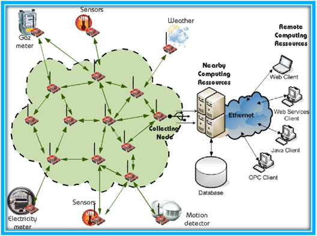

# HUST-OperatingSystem-Labs
Hust OS labs, including TinyOS labs specially for IOT in 2018 Spring

## OperatingSystem Labs

* lab01 - Implement a single pipe and signal handler
* lab02 - Synchronize threads using semaphore
* lab03 - Implement file copy using ring buffer and shared memory
* lab04 - Implement `ls -lR`

Using some codes from `zxcpyplib`.

## TinyOS Labs

### About

* Environment：
  * Software: Arch/TinyOS-2.1.2
  * Hardware: Telosb
* Compiler: msp430
* Language: nesC (Network Embedded System C)

### Details

* Prepare : Getting start with TinyOS and install Blink in it.
* Part  I : Implement a Binary counter using LED and one Timer
* Part II : Add compute in LED 1
* Part III: Implement compute by task
* Part IV : Implement compute by Split-phase task

---

* Prat EX : Simple Wireless Sensor Networks
  * Part EX - 01: Get temporary, humidity and photovoltaic data by sensors, the send broadcast data packets
  * Part EX - 02: Build a base station connected to PC, and transfer data packets to PC by serial
  * Part EX - 03: BUild a java client to analyse the data

